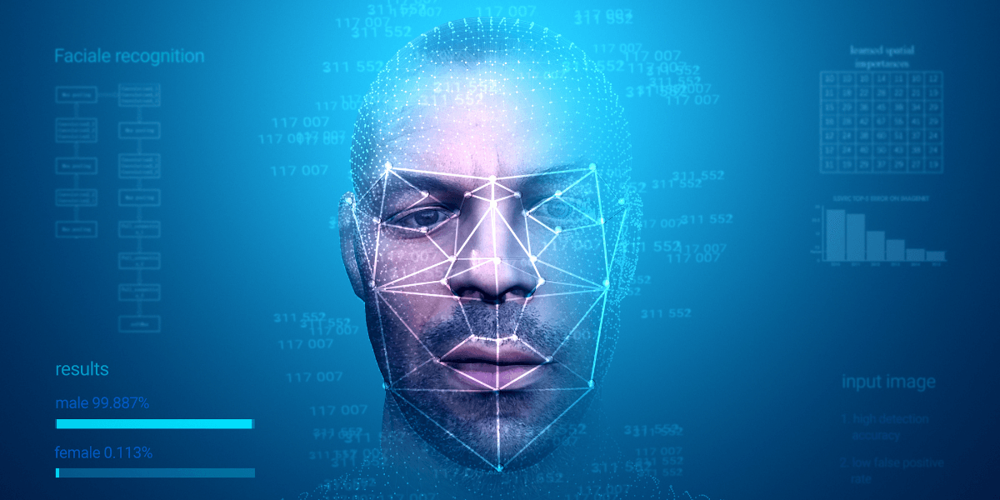
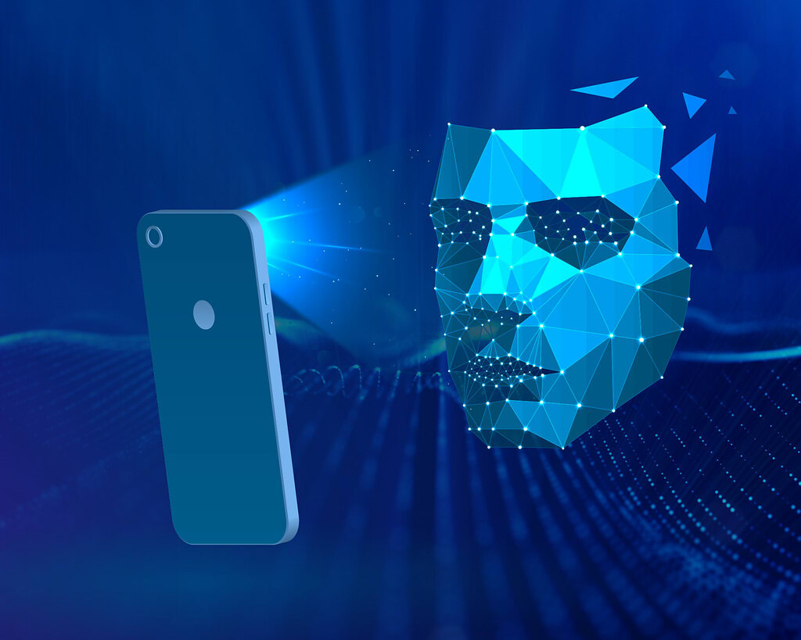

# Facial Detection using Graphics and Animation Techniques

Facial Detection with Graphics and Animation

Project Description
Facial Detection with Graphics and Animation is an exciting project that combines advanced facial detection algorithms with graphics and animation techniques to create an interactive and visually engaging experience. This project goes beyond basic face detection by incorporating dynamic graphics and animations that respond to facial expressions and movements.

Key Features:
High-Accuracy Facial Detection: Utilize state-of-the-art facial detection algorithms to accurately identify and track facial features.

Real-time Animation: Integrate real-time animations that respond to the user's facial expressions and movements.

Dynamic Graphics: Enhance the user experience with dynamic graphics that adapt to changes in facial expressions, creating an interactive and immersive environment.

User Interaction: Enable users to interact with the system through facial gestures, opening up new possibilities for engagement.

Customizable Animations: Allow users to choose or customize animations based on their preferences, creating a personalized experience.

How It Works:
Facial Detection: The system employs robust facial detection algorithms to identify key facial features in real-time.

Animation Mapping: Once facial features are detected, the system maps them to corresponding animations, ensuring a dynamic and synchronized experience.

Real-time Rendering: The graphics and animations are rendered in real-time, creating a responsive and interactive environment.

User Interaction: Users can engage with the system through facial gestures, triggering specific animations or actions.

Use Cases:
Entertainment Applications: Create interactive and entertaining applications that respond to users' facial expressions.

Virtual Avatars: Develop virtual avatars that mimic users' facial movements, providing a fun and personalized experience.

Interactive Art Installations: Implement facial detection in art installations where the audience's expressions influence the visual output.

Gaming: Integrate facial detection into games, allowing characters to react to the player's emotions and expressions.

Facial Detection with Graphics and Animation opens up a realm of possibilities for interactive and visually stunning applications. Whether used for entertainment, art, or gaming, this project aims to push the boundaries of what's possible by merging advanced facial detection with captivating graphics and animations.

